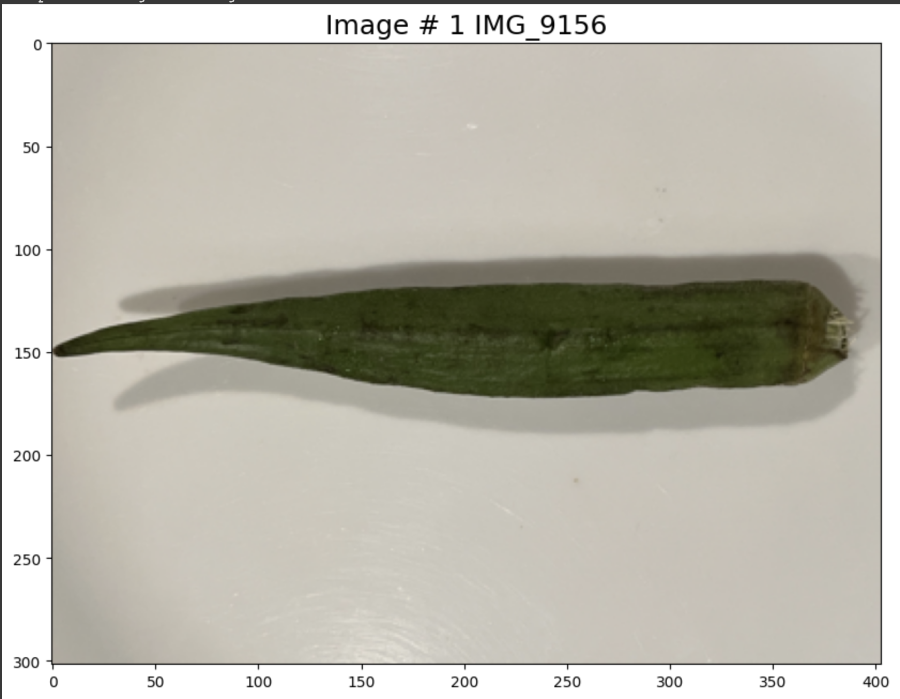
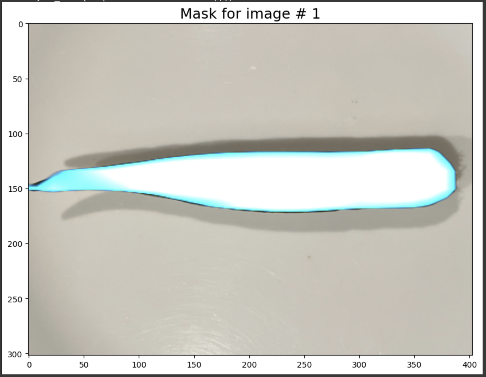
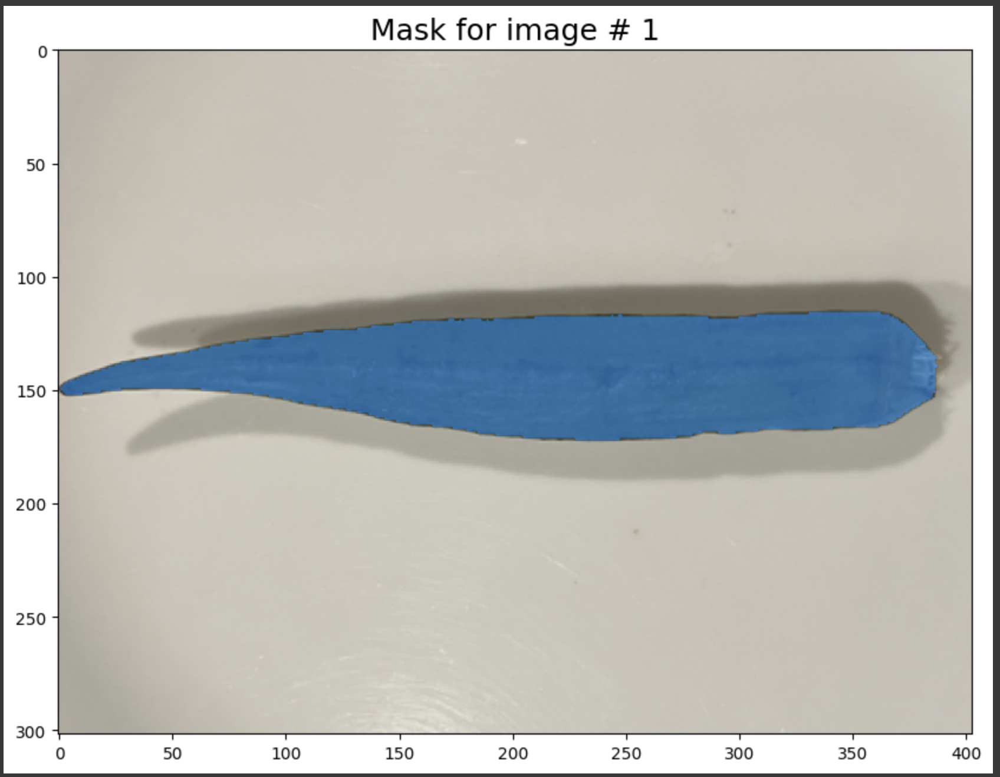

# OkraInsight
The goal of this project is to provide an alternative to people who are not experts in visually determining Okra tenderness at the time of buying and yet do not wish to use the traditional destructive testing method where the tip is bent to see if it snaps clean (test pass) or deforms/sags (test fail). The destructuve method results in accelerating food spoilage and reduces the likelihood of even good Okra being sold when its next to damaged Okra. In addition, when Okra is packaged in a see-through wrapper, or when vendor simply dis-allows, the option of destructive testing may not be possible.  

## What is done ?
As a first step to solve this, I built an Okra mobile segnet model, that can be used to extract the region of image that represents the Okra surface. 

## What is coming next ?
The next steps are to build a classfier that takes the Okra mobile segnet output to extract just the pixels in the Okra surface region and generates a single binary classification of whole Okra into tender or not-tender.

## Details
|  |  | 

### Okra mobile segnet
The code in this project can be used to build, train and evaluate a semantic segmentation network for identifying Okra surface within a 2D image containing single Okra against arbitrary background. This project includes preparing images and groundtruth masks as well. Since the goal is to deploy this model on smartphone like device, I build the segmentation network using the mobile hardware compatible open source torch vision model [<u>DeepLabV3 Mobile-Net</u>][DeepLabV3Website] is customized. 

### Image Dataset
To construct the images, the author used iphone 14 to capture images of okra purchased from local grocery stores. Each okra has 2 images (posterior and anterior pose) to cover all sides of the entire Okra surface. Traditionally customers test Okra for ripeness before buying in the market by selecting each Okra based on a tip-break test. This test is done by giving the tip a quick bend to see if it snaps (pass) or just sags (fail). I applied this same test to generate pass/fail results and stores the results in a table linking it to the corresponding images of the Okra surface. Additionally, the Okra is cut in the middle longitudinally and images of the internal guts of Okra are also taken. But these images are not used in training the model at the moment. 

### Ground Truth Label Generation
I tried 2 approaches to generating the ground truth segmentation masks for Okra

#### 1. Manual region marking by drawing bounding-polygon 
- For this, I used [<u>Labelme</u>][LabelmeWebsite] software to manually edit each Okra image to add an aproximately bounding polygon to define the region of pixels that are part of Okra surface. 

#### 2. Manual pointing of 1 or 2 coordinate points to exemplify the region of pixels in Okra surface. 

- For this, I used a pretrained version of [<u>Segment Anything Model</u>][SAMGithub] that was published recently by [<u>Meta AI research</u>][SAMWebsite] which was able to take as inputs 1 or more coordinates that are valid Okra surface region and generate Okra segmentation masks

The approach 2 produced a higher quality Okra segmentation masks. So I relied on this for training the mobile network for Okra segmentation.

## Training
[images captured from wandb dashboard]
### Loss function

### System resource

[DeepLabV3Website]: <https://github.com/pytorch/vision/tree/main/references/segmentation> "example text"
[SAMGithub]: <https://github.com/facebookresearch/segment-anything>
[SAMWebsite]: <https://ai.meta.com/research/publications/segment-anything/>
[LabelmeWebsite]: <http://labelme.csail.mit.edu/guidelines.html>
