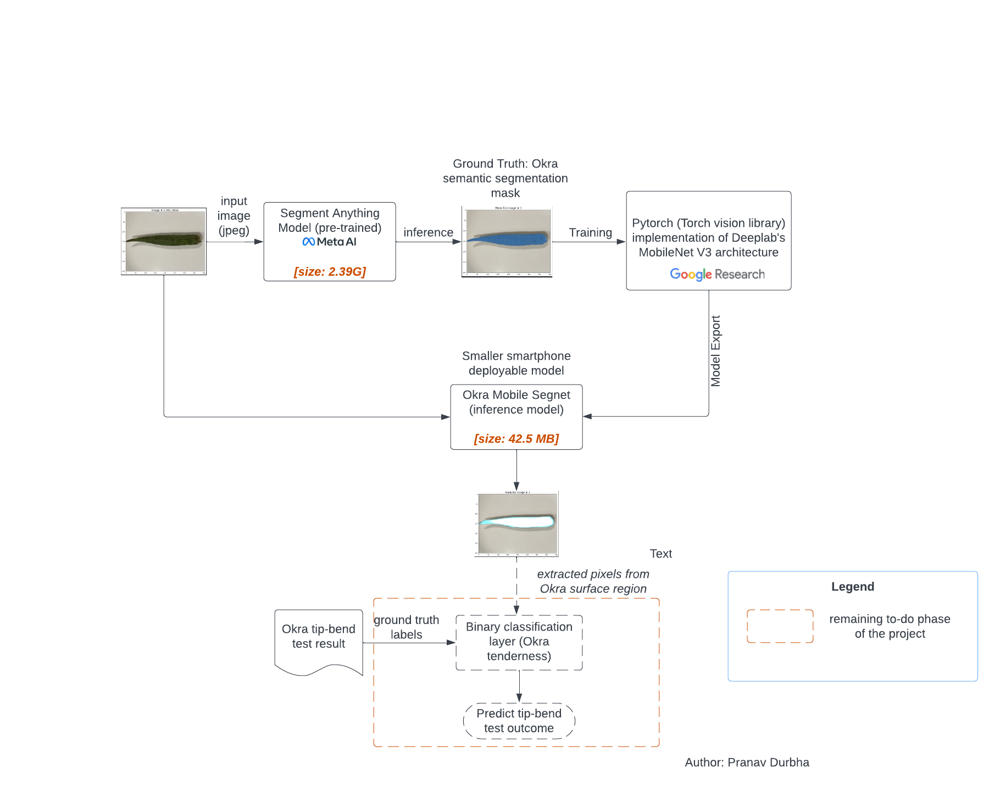
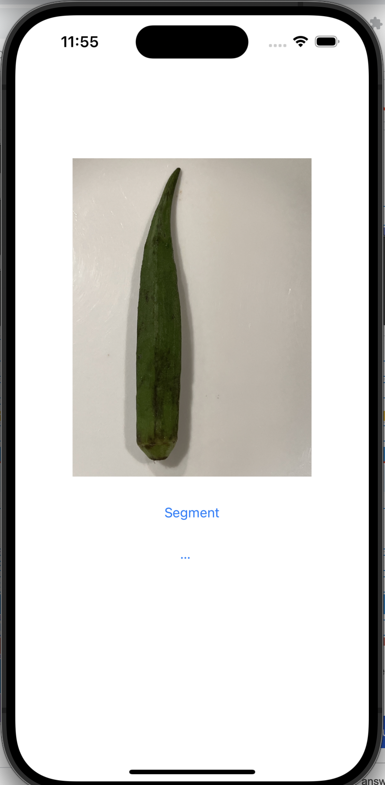
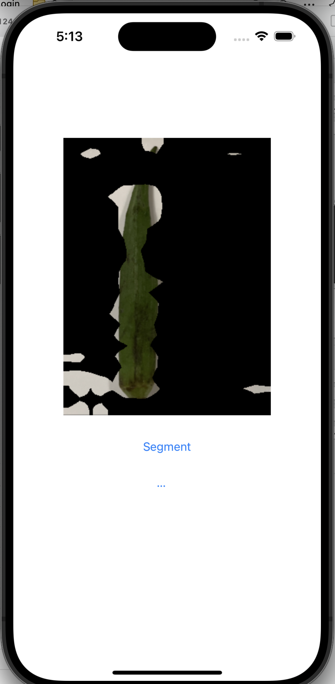
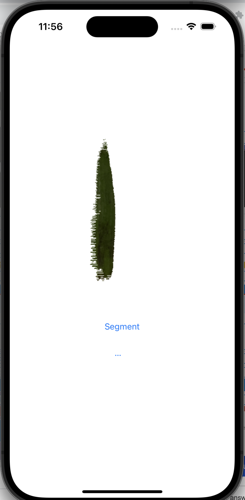

# OkraInsight : Real-time mobile app deployable machine learning based Okra segmentation

 

I use the [<u>pretrained Segment Anything Model (SAM)</u>][SAMGithub] (see [<u>Meta AI research</u>][SAMWebsite]) as a master and train student models (slightly modified [<u>DeepLab Mobile-Net v3</u>][DeepLabV3Website]) as well as ([<u>U-2 Net</u>][U2Net]) to achieve an efficient inference on iphone. For comparison, the master (pre-trained SAM model) is 2.64GB in size, while our student models are just 42.5MB (deeplab) and 16MB (U-2 net) in size. Our knowledge distillation pipeline achieves 60x and 14x reduction in model size while retaining high fidelity in accuracy. Of these student models. U-2 net was is showing greater accuracy on IOS simulator even with shallow training. I'll be following with more longer trained U-2 Net model shortly. 

The eventual goal of this project is to build a machine learning based mobile application on iphone that uses just the real-time camera vision based images of Okra to predict the result of traditional "tip-break-off" test without actually doing it. This is a feasible concept because experts (such as my grandmom) actually are able to confidently "tell" by visually inspecting Okra and willing to forego the tip-break off test. 

The intended impact of this application is to give non-expert users an alternative way to pick right Okra at the grocery store without resorting to destructive (and often discouraged) tip-break-off test. The destructive testing actually contributes to food spoilage and wastage. This act of mutilation leaves "test failed" Okra to be dumped back into the pile along with prospective good Okra. But doing so reduces the likelyhood of even the good ones in the rest of the pile from getting sold. Hence, many vendors explicitly place a notice asking customers not to break Okra to test. And some vendors package them so customers can see but cannot individually break-test before purchase. This iphone based aplication is a cleaner alternative to selecting Okra at your next grocery purchase!

input image (no mask) | deeplab V3 mask (black) | u-2 net mask (white)
--|--|--
 |  | 
--|--|--

## How to run the code
All the executable code is organized into 4 Jupyter notebooks. 
Notebook | Purpose
--|--
OkraSegMaskLabelsWithSegmentAnything.ipynb | Run segment-anything model from Meta AI research by interactively iterate each of the Okra images in the dataset to visualize masks coverage and generate ground truth mask set. 
ExploreOkraDataSet.ipynb | This is a utility to interactively iterate over all the images in the Okra dataset and visualize both the input data and pre-generated ground truth masks.
MobileOkraSegTrain.ipynb | A customized version of train.py from [Torch Vision Deeplab implementation] [DeepLabV3Website] to train deeplab mobilenet v3 model for Okra segmentation. 
ExploreOkraSegnetModel.ipynb | Use this to interactively iterate over all Okra images and visualize the post-trained deeplab mobilenet v3 predictions.

All these 4 notebooks can be executed in Google colab environment. To do so, copy this entire folder into Google Drive location used by your colab environment. 

## Training the model
Based on few trials, I tuned learning rate parameter to be 0.02 and set iterations to 150 epochs. A DeeplabHead classifier with single output classification class was added to the model to generate single slass segmentation. I replaced the default loss function, nn.functional.cross_entropy(), used in pretrained deeplab v3 mobilenet with nn.BCEWithLogitsLoss() to improve segmentation accuracy. The overall loss function response in training is shown in the graph below.  

[<i>images captured from wandb dashboard</i>]
 | 

### Dataset preparation

To construct the images, I used iphone 14 to capture images of okra purchased from local grocery stores. Each okra has 2 images (posterior and anterior pose) to cover all sides of the entire Okra surface. The raw images obtained in .heic format were converted into jpeg format. These are located in the folder  training_data/okra_images . The corresponding ground truth segmentation masks for each image generated using Segment-anything-model (SAM) is in the training/okra_segmentation_target_masks.

### Ground Truth Label Generation
I tried 2 approaches to generating the ground truth segmentation masks for Okra

#### 1. Manual region marking by drawing bounding-polygon 
- For this, I used [<u>Labelme</u>][LabelmeWebsite] software to manually edit each Okra image to add an aproximately bounding polygon to define the region of pixels that are part of Okra surface. 

#### 2. Manual pointing of 1 or 2 coordinate points to exemplify the region of pixels in Okra surface. 

- For this, I used a pretrained version of [<u>Segment Anything Model</u>][SAMGithub] that was published recently by [<u>Meta AI research</u>][SAMWebsite] which was able to take as inputs 1 or more coordinates that are valid Okra surface region and generate Okra segmentation masks

The approach 2 produced a higher quality Okra segmentation masks. So I relied on this for training the mobile network for Okra segmentation.

[DeepLabV3Website]: <https://github.com/pytorch/vision/tree/main/references/segmentation> "example text"
[SAMGithub]: <https://github.com/facebookresearch/segment-anything>
[SAMWebsite]: <https://ai.meta.com/research/publications/segment-anything/>
[LabelmeWebsite]: <http://labelme.csail.mit.edu/guidelines.html>
[PytorchUnet]: <https://github.com/milesial/Pytorch-UNet/tree/master>
[DeeplabOnIOS]: <https://pytorch.org/tutorials/beginner/deeplabv3_on_ios.html>
[U2Net]: <https://github.com/xuebinqin/U-2-Net>
