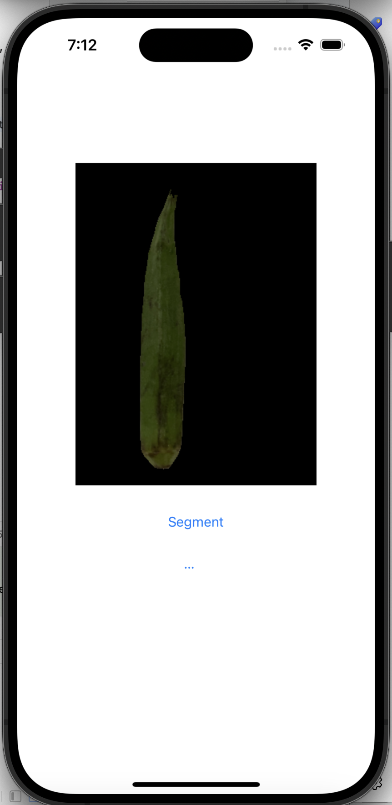

# OkraInsight : Real-time mobile app deployable machine learning based Okra segmentation

 

I use the much larger (2.39GB) [<u>pretrained Segment Anything Model (SAM)</u>][SAMGithub] (see [<u>Meta AI research</u>][SAMWebsite]) as a master model to automatically generate high quality Okra segmentation lables for the Okra images I took with my iphone at home. This model cannot be used as-is for my application because it needs user to pick atleast 1 sample point on Okra surface to work and is difficult to fit in the limited memory of a smartphone. Nvertheless, it proved very effective to automatically generate higher quality ground truth labeling for Okra segmentation than what I was able to with label generating software [<u>Labelme</u>][LabelmeWebsite] to manually edit each Okra image to add an aproximately bounding polygon to define the region of pixels that are part of Okra surface. 

Original image | segment-anything predicted mask | labelme manual created mask
--|--|--
 |  | 
--|--|--

For mobile phone friendly segmentation I evaluated 2 popular models as transfer learning student models - (1) (slightly modified [<u>DeepLab Mobile-Net v3</u>][DeepLabV3Website]) and (2) ([<u>U-2 Net</u>][U2Net]). Both these models came with training scripts which I used to train using custom images of Okra. Deeplab V3 mobilenet is most size efficient (saved trained model was 2.39GB, including the network and weights). While it produced accurate segmentation when running on Colab servers, the same saved model running in IOS simulator did not retain the accuracy. The background (non-Okra) is masked out as black and we can see non-Okra regions are not fully blacked out. The U-2 net proved more promising even though its much bigger than Deeplab V3 mobilenet, it is still 14X smaller than the master model. And even with very limited training it is already showing more promising results in terms of accuracy when run in IOS simulator. U-2 net is likely a better network for Okra segmentation and I will be trying out a more longer trained version of this network as next step. 

input image (no mask) | deeplab V3 Okra segment | u-2 net Okra segment
--|--|--
 |  | 

The eventual goal of this project is to build a machine learning based mobile application on iphone that uses just the real-time camera vision based images of Okra to predict the result of traditional "tip-break-off" test without actually doing it. This is a feasible concept because experts (such as my grandmom) actually are able to confidently "tell" by visually inspecting Okra and willing to forego the tip-break off test. 

The intended impact of this application is to give non-expert users an alternative way to pick right Okra at the grocery store without resorting to destructive (and often discouraged) tip-break-off test. The destructive testing actually contributes to food spoilage and wastage. This act of mutilation leaves "test failed" Okra to be dumped back into the pile along with prospective good Okra. But doing so reduces the likelyhood of even the good ones in the rest of the pile from getting sold. Hence, many vendors explicitly place a notice asking customers not to break Okra to test. And some vendors package them so customers can see but cannot individually break-test before purchase. This iphone based aplication is a cleaner alternative to selecting Okra at your next grocery purchase!

## How to run the code
All the executable code is organized into 4 Jupyter notebooks. 
Notebook | Purpose
--|--
OkraSegMaskLabelsWithSegmentAnything.ipynb | Run segment-anything model from Meta AI research by interactively iterate each of the Okra images in the dataset to visualize masks coverage and generate ground truth mask set. 
ExploreOkraDataSet.ipynb | This is a utility to interactively iterate over all the images in the Okra dataset and visualize both the input data and pre-generated ground truth masks.
MobileOkraSegTrain.ipynb | A customized version of train.py from [Torch Vision Deeplab implementation] [DeepLabV3Website] to train deeplab mobilenet v3 model for Okra segmentation. 
OkraU2netTrain.ipynb | A customized version of train.py from [U-2 net implementation] [U2Net] to train U-2 mobile net for Okra segmentation.
ExploreOkraSegnetModel.ipynb | Use this to interactively iterate over all Okra images and visualize the post-trained deeplab mobilenet v3 predictions.

All these 4 notebooks can be executed in Google colab environment. To do so, copy this entire folder into Google Drive location used by your colab environment. 

## Training the model
Based on few trials, I tuned learning rate parameter to be 0.02 and set iterations to 150 epochs. A DeeplabHead classifier with single output classification class was added to the model to generate single slass segmentation. I replaced the default loss function, nn.functional.cross_entropy(), used in pretrained deeplab v3 mobilenet with nn.BCEWithLogitsLoss() to improve segmentation accuracy. The overall loss function response in training is shown in the graph below.  

[<i>images captured from wandb dashboard</i>]
 | 

### Dataset preparation

To construct the images, I used iphone 14 to capture images of okra purchased from local grocery stores. Each okra has 2 images (posterior and anterior pose) to cover all sides of the entire Okra surface. The raw images obtained in .heic format were converted into jpeg format. These are located in the folder  training_data/okra_images . The corresponding ground truth segmentation masks for each image generated using Segment-anything-model (SAM) is in the training/okra_segmentation_target_masks.

[DeepLabV3Website]: <https://github.com/pytorch/vision/tree/main/references/segmentation> "example text"
[SAMGithub]: <https://github.com/facebookresearch/segment-anything>
[SAMWebsite]: <https://ai.meta.com/research/publications/segment-anything/>
[LabelmeWebsite]: <http://labelme.csail.mit.edu/guidelines.html>
[PytorchUnet]: <https://github.com/milesial/Pytorch-UNet/tree/master>
[DeeplabOnIOS]: <https://pytorch.org/tutorials/beginner/deeplabv3_on_ios.html>
[U2Net]: <https://github.com/xuebinqin/U-2-Net>
