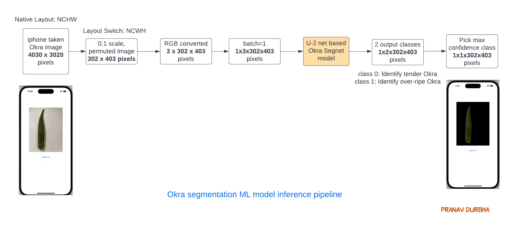
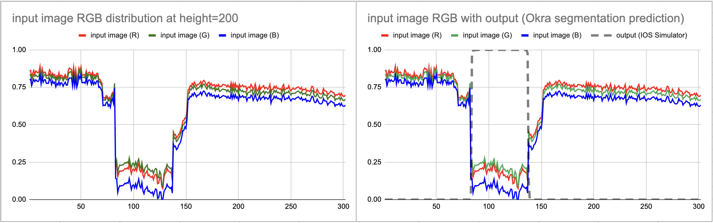

<!-- vscode-markdown-toc -->
* 1. [Motivation](#Motivation)
* 2. [Overview](#Overview)
* 3. [ML training pipeline](#MLtrainingpipeline)
* 4. [ML inference pipeline](#MLinferencepipeline)
* 5. [Input stimulus and response curves](#Inputstimulusandresponsecurves)
* 6. [How to run the code](#Howtorunthecode)
* 7. [Training the model](#Trainingthemodel)
	* 7.1. [Dataset preparation](#Datasetpreparation)
* 8. [Deploying to your iPhone for testing](#DeployingtoyouriPhonefortesting)
	* 8.1. [Pair your iphone with Xcode](#PairyouriphonewithXcode)
	* 8.2. [Set your iphone as Run destination](#SetyouriphoneasRundestination)
* 9. [9. Future work](#Futurework)

<!-- vscode-markdown-toc-config
	numbering=true
	autoSave=true
	/vscode-markdown-toc-config -->
<!-- /vscode-markdown-toc -->

# OkraInsight : Real-time mobile app deployable machine learning based Okra segmentation

(Note: <I>This is now available for download and trying on you IOS device at [<u>Apple App store</u>][iosApp]</I>)

##  1. Motivation
The intended impact of this application is to give non-expert users an alternative way to pick right Okra at the grocery store without resorting to destructive (and often discouraged) tip-break-off test. The destructive testing actually contributes to food spoilage and wastage. This act of mutilation leaves "test failed" Okra to be dumped back into the pile along with prospective good Okra. But doing so reduces the likelyhood of even the good ones in the rest of the pile from getting sold. Hence, many vendors explicitly place a notice asking customers not to break Okra to test. And some vendors package them so customers can see but cannot individually break-test before purchase. This iphone based aplication is a cleaner alternative to selecting Okra at your next grocery purchase!

##  2. Overview
In order to predict if Okra will pass/fail a tip-bend test without actually bending the tip, we would need to rely on learning some correlation with Okra surface features. Image segemntation specialized for Okra would be able to identify the pixels in the image that are on the Okra surface. Several image segmentation architectures exist to choose from, of which Unet based architecture is popular for being smaller (and hence better fit for mobile phone) and for better accuracy on small image objects (medical etc). I used ([<u>U-2 Net</u>][U2Net]) to explore building Okra segmentation. Another model architecture I explored is [<u>DeepLab Mobile-Net v3</u>][DeepLabV3Website]). This was the smallest model (43MB) and runs fast. Both these models were capable of generating multi-class output, but had to be trained from scratch (pre-trained models do not work well for Okra segmentation). There is a new [<u>pretrained Segment Anything Model (SAM)</u>][SAMGithub] (see [<u>Meta AI research</u>][SAMWebsite]) that is capable of segmenting Okra without additional training. But it is unsuitable for our application for two reasons - (1) it is too large (2.39G) to be deployed into memory limited device like iPhone, and (2) it requires user input for example points on Okra which is not convenient for our application. But it is very useful to generate ground-truth segementation masks for custom Okra dataset. In terms of  using on the iPhone, while Deeplab Mobilenet is faster and smaller (56x smaller than segment-anything) but U-2 Net model which is slightly bigger (still 14x smaller than segment-anythig) achieves higher accuracy for Okra segmentation. 
 

The basic idea of image segmentation model is to generate a mask which is the same size as input impage, but for each corresponding image pixel, it will provide a value between 0 and 1. This value can be interpreted as weighted average of confidence of predicting the pixel in image to be class 0 (non-okra background) or class 1 (okra surface). For example, a value on 0.1 shows 90% confidence it is class 0 and 10% confidence it is class 1. In multi-class output, one mask per class is produced. In our application, the idea is to use 2 classes - one for "fresh Okra" and other for "not fresh" Okra. Since both masks are generated, we would need to select the mask which has higher avergage "confidence" as the winning class. 

##  3. ML training pipeline 

##  4. ML inference pipeline 

##  5. Input stimulus and response curves

##  6. How to run the code
All the executable code is organized into 4 Jupyter notebooks. 
Notebook | Purpose
--|--
OkraSegMaskLabelsWithSegmentAnything.ipynb | Run segment-anything model from Meta AI research by interactively iterate each of the Okra images in the dataset to visualize masks coverage and generate ground truth mask set. 
ExploreOkraDataSet.ipynb | This is a utility to interactively iterate over all the images in the Okra dataset and visualize both the input data and pre-generated ground truth masks.
MobileOkraSegTrain.ipynb | A customized version of train.py from [Torch Vision Deeplab implementation] [DeepLabV3Website] to train deeplab mobilenet v3 model for Okra segmentation. 
OkraU2netTrain.ipynb | A customized version of train.py from [U-2 net implementation] [U2Net] to train U-2 mobile net for Okra segmentation.
ExploreOkraSegnetModel.ipynb | Use this to interactively iterate over all Okra images and visualize the post-trained deeplab mobilenet v3 predictions.

All these 4 notebooks can be executed in Google colab environment. To do so, copy this entire folder into Google Drive location used by your colab environment. 

##  7. Training the model
Based on few trials, I tuned learning rate parameter to be 0.02 and set iterations to 150 epochs. A DeeplabHead classifier with single output classification class was added to the model to generate single slass segmentation. I replaced the default loss function, nn.functional.cross_entropy(), used in pretrained deeplab v3 mobilenet with nn.BCEWithLogitsLoss() to improve segmentation accuracy. The overall loss function response in training is shown in the graph below.  

[<i>images captured from wandb dashboard</i>]

 | 

###  7.1. Dataset preparation

To construct the images, I used iphone 14 to capture images of okra purchased from local grocery stores. Each okra has 2 images (posterior and anterior pose) to cover all sides of the entire Okra surface. The raw images obtained in .heic format were converted into jpeg format. These are located in the folder  training_data/okra_images . The corresponding ground truth segmentation masks for each image generated using Segment-anything-model (SAM) is in the training/okra_segmentation_target_masks.

##  8. Deploying to your iPhone for testing

###  8.1. Pair your iphone with Xcode 
(_Instructions that work with iPhone 12/13/14 on ios17 with Xcode 15_)
- Open Xcode and go to Window > Devices and Simulators.
- Plug your iOS device into your Mac using a lightning cable. You may need to select to Trust This Computer on your device.
- Select your device and then select the Connect via network checkbox to pair your device.
- Open your project on Xcode.
- Plug in your iPhone with USB cable.
- Open Window > Devices and Simulators. You should see your device as connected devices.
- Select Devices from the top, Select your device from left and Check the “Connect via network” box.

###  8.2. Set your iphone as Run destination
- In the Xcode, pull down menu in top bar and make sure your iphone device is selected
- Trigger build and run. This step will automatically compile App, transfer compiled executable to your iPhone and launch the App on your iPhone.

 |  | 
--|--|--

##  9. Limitations and future work
- Model is currently trained with limited data augmentation and data set size (30 unique Okra images). Hence for best results, single Okra should be placed on a near white background with full vertical length of Okra just fitting within the screen. Because the App is very sensitive to image noise at the moment, taking pictures of same Okra from different angles and positions might result in different classifications. To make this more resilient to real world noise, image normalization and rotating images to various angles as well as different zoom levels would significantly help.

[DeepLabV3Website]: <https://github.com/pytorch/vision/tree/main/references/segmentation> "example text"
[SAMGithub]: <https://github.com/facebookresearch/segment-anything>
[SAMWebsite]: <https://ai.meta.com/research/publications/segment-anything/>
[LabelmeWebsite]: <http://labelme.csail.mit.edu/guidelines.html>
[PytorchUnet]: <https://github.com/milesial/Pytorch-UNet/tree/master>
[DeeplabOnIOS]: <https://pytorch.org/tutorials/beginner/deeplabv3_on_ios.html>
[U2Net]: <https://github.com/xuebinqin/U-2-Net>
[iosApp]: <https://apps.apple.com/us/app/okrainsight/id6473683764>
